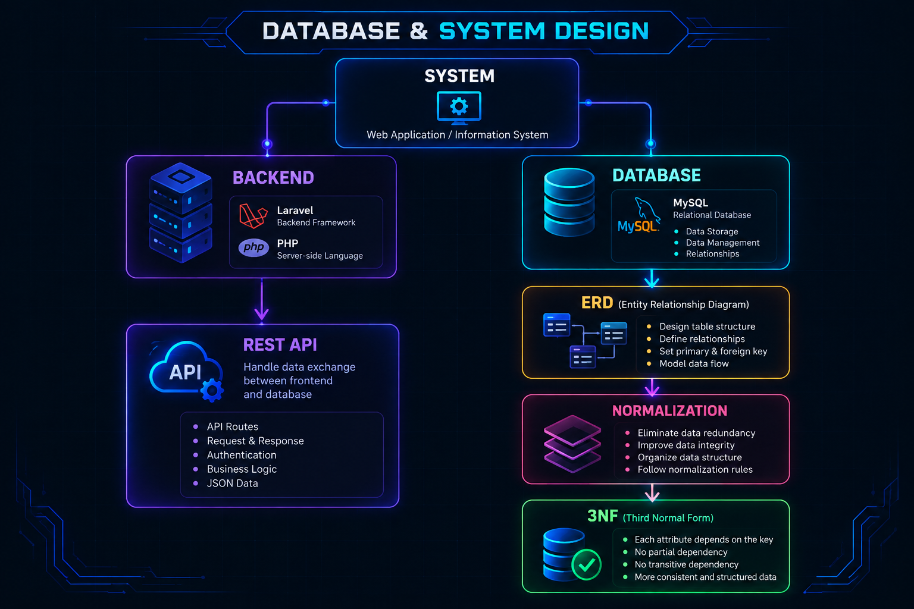
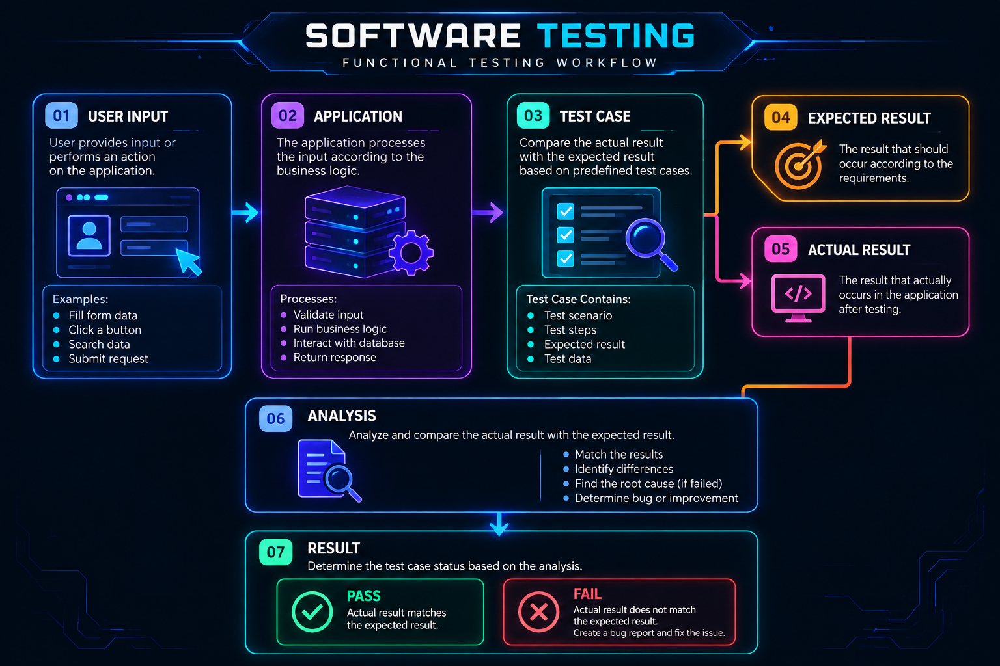
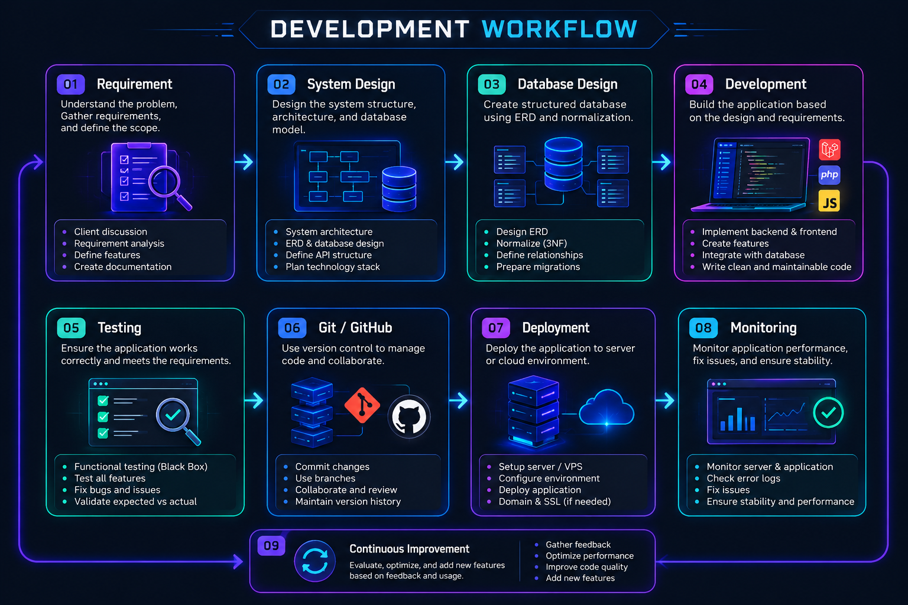
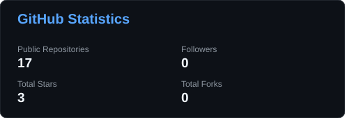
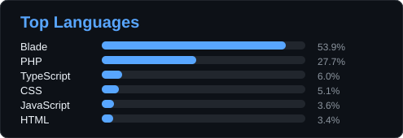
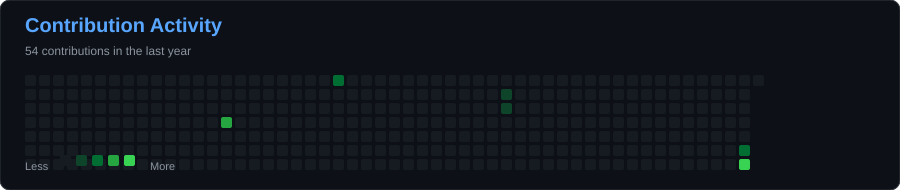

<div align="center">


# Hi, I'm David Stanley

### Informatics Engineering Student | Full Stack Web Developer | Software Engineer

<p>
  
  <a href="https://github.com/Davidst230404?tab=followers">
    
  </a>
  
</p>

</div>

---

## About Me

I am an Informatics Engineering student focused on **Full Stack Web Development, Backend Engineering, Database Design, Software Testing, and Application Deployment**.

My development experience covers the application lifecycle from system and database design, backend implementation, API development, testing, debugging, version control, and deployment.

```text
Current Role       : Informatics Engineering Student
Primary Focus      : Full Stack Web Development
Backend            : PHP, Laravel, JavaScript
Frontend            : HTML, CSS, JavaScript
Database            : MySQL, Relational Database Design
API                 : REST API
Testing             : Black Box Testing
Version Control     : Git, GitHub
Environment         : Linux, VPS, Vercel
Currently Learning  : DevOps, CI/CD, System Architecture
```

> Build with purpose. Learn continuously. Improve every iteration.

---

## Technical Skills

### Backend Development

- PHP
- Laravel
- JavaScript
- REST API
- CRUD Application Development
- Backend Architecture

### Frontend Development

- HTML
- CSS
- JavaScript
- Blade
- Responsive Web Development

### Database

- MySQL
- Relational Database Design
- Entity Relationship Diagram
- Database Normalization
- Third Normal Form (3NF)
- Database Relationships
- CRUD Operations

### Software Engineering

- Git
- GitHub
- Black Box Testing
- Debugging
- API Integration
- System Design
- Software Development Lifecycle

### Deployment & Infrastructure

- Linux
- VPS
- Vercel
- Application Deployment
- Basic Networking
- DevOps Fundamentals
- CI/CD Fundamentals

---

## Technology Stack

<div align="center">

### Programming Languages

<p>
  
</p>

`PHP` `JavaScript` `HTML` `CSS` `SQL`

---

### Backend & Frameworks

<p>
  
</p>

`Laravel` `Node.js` `Express.js` `Next.js`

---

### Frontend

<p>
  
</p>

`React.js` `Vue.js` `Next.js` `Tailwind CSS` `Bootstrap 5`

---

### Database

<p>
  
</p>

`MySQL` `PostgreSQL`

**Database Engineering**

`ERD` `Normalization` `3NF` `Query Optimization` `Relational Database`

---

### API & Development Tools

<p>
  
</p>

`REST API` `Postman` `Git` `GitHub` `VS Code`

---

### DevOps & Deployment

<p>
  
</p>

`Linux` `VPS` `Vercel` `Manual Deployment` `CI/CD Fundamentals`

---

### Networking & Security

`MikroTik` `TCP/IP` `Subnetting` `Basic Firewall`

`NIDS/HIDS` `SIEM Fundamentals`

---

### Additional Technologies

`Chart.js` `Framer Motion` `Vite`

</div>

---

## Practical Experience

### Full Stack Web Development

My practical development experience includes building web applications from initial requirements through development, testing, and deployment.

Key areas of experience:

- Designing relational databases and application structures
- Developing backend functionality using Laravel and PHP
- Building CRUD-based applications
- Developing and integrating REST APIs
- Implementing authentication and role-based functionality
- Creating responsive interfaces using Blade, HTML, CSS, and JavaScript
- Performing functional testing using Black Box Testing
- Debugging application and deployment issues
- Managing source code with Git and GitHub
- Deploying applications to VPS and cloud environments

---

## Featured Projects

### Parman Farm — Agricultural Management System

A web-based management system developed for an agricultural business to manage operational data through a centralized application.

The project covers application development from database design and backend implementation to deployment and client handover.

**Technology**

`Laravel` `PHP` `MySQL` `Blade` `Tailwind CSS` `JavaScript` `Vite`

**Development Scope**

- Web application development
- Database design
- CRUD functionality
- Authentication and role management
- Agricultural data management
- Application testing
- Production deployment
- Client handover

---

### NusaERP — ERP SaaS Concept

A SaaS-oriented ERP platform concept designed to support small and medium-sized businesses through an integrated business management system.

**Planned Modules**

- Point of Sale
- Inventory Management
- Finance
- Customer Relationship Management
- Purchasing
- Business Reporting
- User and Role Management

**Technology**

`Laravel` `PHP` `MySQL` `Blade` `JavaScript`

The project focuses on scalable relational database design, modular application architecture, and SaaS-oriented development.

---

### Full Stack Web Applications

Developed web applications with structured backend logic, relational databases, API integration, authentication, CRUD functionality, testing, and deployment.

**Technology**

`Laravel` `PHP` `JavaScript` `MySQL` `REST API`

---

### Android Application

Explored Android application development using Kotlin as part of expanding software development capabilities beyond web applications.

**Technology**

`Kotlin` `Android`

---

## Database & System Design

My approach to system and database design focuses on structured application architecture, relational data modeling, and clear separation between application logic and data management.



Areas of focus:

- Entity Relationship Diagram
- Relational database architecture
- Database normalization
- Third Normal Form
- Primary and foreign key relationships
- Data integrity
- CRUD operations
- Application-to-database integration

---

## Software Testing

I apply functional testing approaches to validate application behavior against expected requirements.



Testing activities include:

- Functional testing
- Black Box Testing
- Test case creation
- Expected vs actual result validation
- Bug identification
- Regression testing
- Debugging and issue verification

---

## Development Workflow

The development process is organized around clear requirements, structured design, implementation, validation, version control, deployment, and continuous improvement.



---

## DevOps & Infrastructure Learning

Currently expanding knowledge in:

- Linux server administration
- VPS management
- Git-based development workflow
- CI/CD pipelines
- Application deployment
- Networking fundamentals
- Server environment configuration
- System architecture
- Deployment automation

---

## GitHub Statistics

<div align="center">





<br><br>


</div>

</div>

---

## Contribution Activity

<div align="center">



</div>

---

## Engineering Principles

```text
01. Understand the problem before writing code.
02. Design the system before implementation.
03. Keep code structured and maintainable.
04. Design databases carefully.
05. Test functionality before deployment.
06. Use Git to maintain development history.
07. Document important technical decisions.
08. Treat bugs as part of the development process.
09. Continuously improve the system.
10. Keep learning new technologies and engineering practices.
```

---

## Current Focus

```text
Full Stack Web Development
Backend Engineering
Laravel & PHP
Database Engineering
REST API Development
Software Testing
Linux & VPS
DevOps
CI/CD
System Architecture
```

---

## Connect

<div align="center">

<a href="https://github.com/Davidst230404">
  
</a>

</div>

---

<div align="center">

**David Stanley | Informatics Engineering | Full Stack Web Development**

</div>
